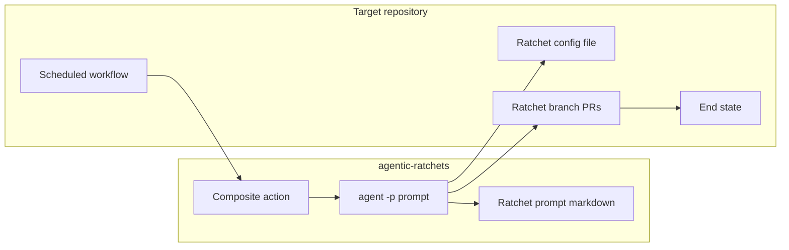

# Agentic ratchets

An **agentic ratchet** is scheduled automation that moves a repository toward a quality goal by opening **small, throttled pull requests**. Each PR is executed and babysat by a Cursor agent using a versioned prompt in this repo.

## Operating model

| Principle | Behavior |
|-----------|----------|
| **Throttled PRs** | At most one open ratchet-owned branch per config signature until required CI is green; then wait for merge before the next slice |
| **Incremental goal** | Each PR advances one step (scope peel, rule tighten, fixes) — no single PR flips the whole codebase |
| **Signed identity** | Every ratchet PR body includes `#lint-ratchet-<sha256>` (or future ratchet prefix) derived from the ratchet config file |
| **Agent execution** | CI installs the [Cursor Agent CLI](https://cursor.com/docs/cli/overview), then runs `agent -p` with the ratchet prompt and `--workspace` set to the target repo |

## Shared vs per-ratchet

| Layer | Reused across ratchets | Unique per ratchet |
|-------|------------------------|-------------------|
| **Behavior** | Throttled PRs, config-derived signature in PR body, incremental slices, CI babysitting | End goal, phases, tools (linters vs mutators), rules inside `RATCHET.md` |
| **CI** | curl-install `agent`, target checkout, prompt bundled in composite action, git bot identity, preflight dedupe | Composite action path, config filename, branch prefix, signature prefix (`#lint-ratchet-` vs future prefixes) |
| **Target repo** | Workflow in same repo as `repo.repository`; Actions may open PRs; secrets for `CURSOR_API_KEY` | Config file content and `setup` knobs |
| **This repo** | Family docs, release pattern | `.github/actions/<ratchet>/` (prompt beside action, e.g. `RATCHET.md`) |

Architecture detail: [.dev/docs/architecture.md](https://github.com/invisible-tech/agentic-ratchets/blob/main/.dev/docs/architecture.md).

## Ratchets in this repo

| Ratchet | Status | Goal |
|---------|--------|------|
| [agentic-lint-ratchet](lint-ratchet.md) | Available | Add and tighten opinionated linting until CI is fully green on intended code |
| [agentic-mutation-testing-ratchet](mutation-testing-ratchet.md) | Available | Add and expand mutation testing; fix edge-case bugs as coverage grows |

New ratchets add a prompt + composite action; they do not change the shared throttle/sign/agent shell.
